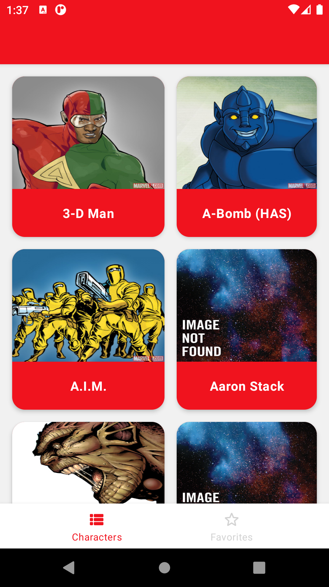
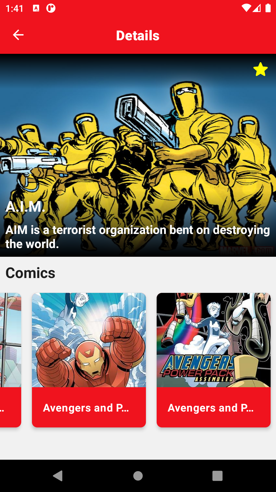
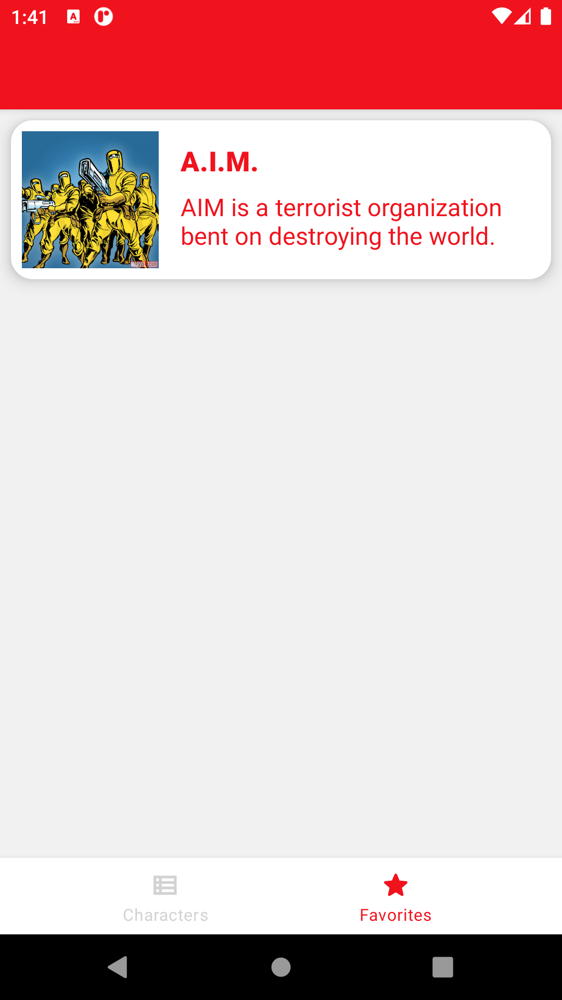

## Features

* Kotlin Coroutines with Flow
* MVVM Architecture
* Clean Architecture
* Multi-module Architecture
* Kotlin Gradle DSL

## Screenshots

|             Characters Screen               |                Details Screen                |               Favorites Screen             | 
| :-----------------------------------------: | :-----------------------------------------: |:-----------------------------------------: |                           
| |  |  | 

## Libraries

* [Navigation Component](https://developer.android.com/guide/navigation/navigation-getting-started)

* [Paging 3](https://developer.android.com/topic/libraries/architecture/paging/v3-overview)

* [LiveData](https://developer.android.com/jetpack/androidx/releases/lifecycle)

* [Dagger Hilt](https://dagger.dev/hilt/)

* [Retrofit](https://square.github.io/retrofit/)

* [Coroutines](https://github.com/Kotlin/kotlinx.coroutines)

* [Room](https://developer.android.com/training/data-storage/room)

* [Timber](https://github.com/JakeWharton/timber)

* [Moshi](https://github.com/square/moshi)

* [okhttp-logging-interceptor](https://github.com/square/okhttp/blob/master/okhttp-logging-interceptor/README.md)

* [MockWebServer](https://github.com/square/okhttp/tree/master/mockwebserver)

* [Truth](https://truth.dev/)

* [MockK](https://mockk.io/ANDROID.html)

# Module Design

| Module name        | Type                 | Description                                                      |
| -------------      | -------------        | -------------                                                    |
| [app](/app/)       | Android Application  | MainActivity, Custom Application classes and navigation setup.                |
| [core](/core/)     | Android Library      | Core components, business, remote, cache models and classes also DI modules.                                |
| [remote](/remote/) | Java/Kotlin Library  | Api factory, interceptor classes and base mapper class for remote models.            |
| [characters](/characters/)     | Android Library      | UI components for the Characters,Details and Favorites screen                           |
| [common](/common/) | Android Library      | Common components like resources, views, base classes.                                              |

